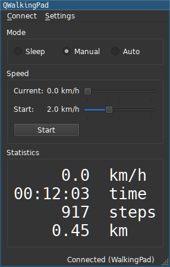

# QWalkingPad

Simple desktop application for controlling the [Kingsmith WalkingPad](https://walkingpad.com) over BLE (Bluetooth Low Energy).




- Control from command line while the application is running:
  - `qwalkingpad start`
  - `qwalkingpad addSpeed <speed>` (speed in 0.1 km/h)
  - `qwalkingpad setSpeed <speed>`
- Track statistics in CSV file.
- Set speed in 0.1 km/h increments (not possible with the [app](https://play.google.com/store/apps/details?id=com.walkingpad.app) or remote)
- (Maybe) cross-platform, written in C++ with Qt (only tested on Arch Linux with the WalkingPad A1 Pro).
- *eternal alpha*, contributions welcome
- Reverse engineered with love

## Build

### Linux

Dependencies on Arch Linux: `qt6-base`, `qt6-connectivity` and the usual C++ development stuff (let me know if something is missing).

Clone with `--recursive` or use `git submodule init; git submodule update`.

```sh
mkdir build && cd build
cmake .. -DCMAKE_BUILD_TYPE=RELEASE
make -j
```

### Windows

Prebuilt: https://github.com/DorianRudolph/QWalkingPad/releases/tag/win-0.1

Dependencies: MSVC (or clang-cl) and Qt6.

Use `win` branch. Open "x64 Native Tools Command Prompt for VS 2022", navigate to project directory and run:

```
mkdir build
cd build
cmake -DCMAKE_BUILD_TYPE=Release -G Ninja ..
ninja
```

## Related Work

- https://github.com/ph4r05/ph4-walkingpad/
- https://gitlab.com/pedropombeiro/walkingpad-control
